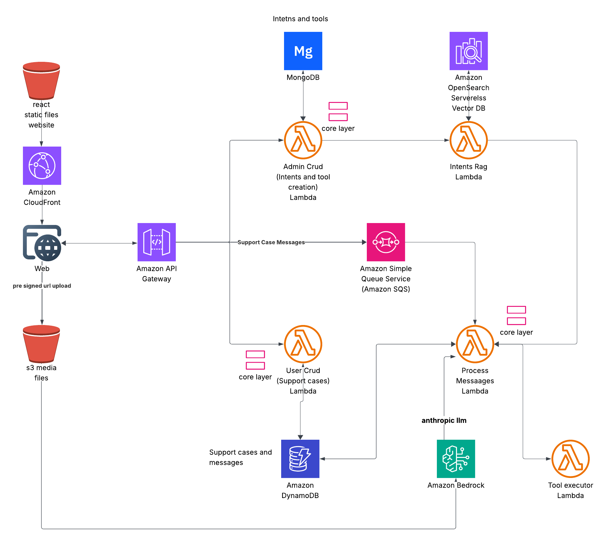

# Architecture Overview

## Heart of Sitaara: Serverless Lambda Functions
Lambda functions serve as the core orchestration layer that handles all business logic, from intent recognition and case management to AI processing and tool execution, making the entire system event-driven and serverless.

### Lambda Functions Breakdown
1. **User CRUD (Support cases) Lambda:** Handles CRUD operations for support cases and customer data stored in DynamoDB
2. **Admin CRUD (Intents and tool creation) Lambda:** Manages creation, updates, and deletion of intents and tools stored in MongoDB
3. **Intents RAG Lambda:** Performs vector search in OpenSearch Serverless to identify customer intent using semantic similarity matching
4. **Process Messages Lambda:** Main orchestrator that processes incoming support messages from SQS and coordinates the entire conversation flow
5. **Tool Executor Lambda:** Executes custom Python scripts/tools dynamically when the AI agent needs to perform specific automated actions

### Frontend Layer
- **Web Application**: React-based frontend with pre-signed URL upload capability for file handling
- **Amazon API Gateway**: Serves as the entry point for all client requests with proper CORS configuration

# Core Processing Flow

### **Phase 1: Admin Configuration**

**Admin creates intents (topics) and custom tools through the Admin CRUD Lambda, storing standardized SOPs with step-by-step workflows in MongoDB.** 

These intents define how specific customer issues should be handled, including which tools to execute and what questions to ask, creating a comprehensive knowledge base for automated resolution.

### **Phase 2: Customer Interaction & Intent Recognition**

**Customer sends a support message which creates a case in DynamoDB and triggers the Process Messages Lambda via SQS.** 

The Intents RAG Lambda performs vector search in OpenSearch to identify the customer's intent with confidence scoring - if >90% confident, it proceeds automatically; if <50%, it presents multiple intent options to human agents for verification and selection.

### **Phase 3: Automated Resolution & Case Completion**

**Once intent is confirmed, the AI agent follows the predefined SOP steps, executes necessary tools via Tool Executor Lambda, and maintains conversation with the customer until resolution.** 

Throughout the process, all interactions are stored in DynamoDB, and upon completion, a comprehensive case summary is generated analyzing the customer issue, AI performance, resolution effectiveness, and customer satisfaction for continuous improvement.

# **Key Architectural Patterns**

**Serverless-First Design**: All compute is handled by AWS Lambda functions, ensuring automatic scaling and cost optimization.

**Event-Driven Architecture**: Uses SQS for decoupling message processing, allowing for better resilience and scalability.

**Microservices Pattern**: Each Lambda function has a specific responsibility (CRUD operations, message processing, tool execution).

**Shared Layer**: Common utilities and business logic are shared across Lambda functions through a core layer, promoting code reuse and consistency.

## **Data Flow Process**

1. **User Request** → API Gateway → Appropriate Lambda function
2. **Message Processing** → SQS → Process Messages Lambda
3. **Intent Recognition** → Intents RAG Lambda → OpenSearch Vector DB
4. **AI Processing** → Anthropic LLM via Bedrock
5. **Tool Execution** → Tool Executor Lambda (when needed)
6. **Data Persistence** → DynamoDB (cases/messages) + MongoDB (intents/tools)

## **Integration Points**

**Vector Search**: OpenSearch Serverless provides semantic similarity search for intent matching

**AI Integration**: Bedrock serves as the managed AI service layer

**File Handling**: S3 integration with pre-signed URLs for secure file uploads

**Message Queuing**: SQS ensures reliable message processing and system resilience

[Want to try it yourself?](TRYIT.md)