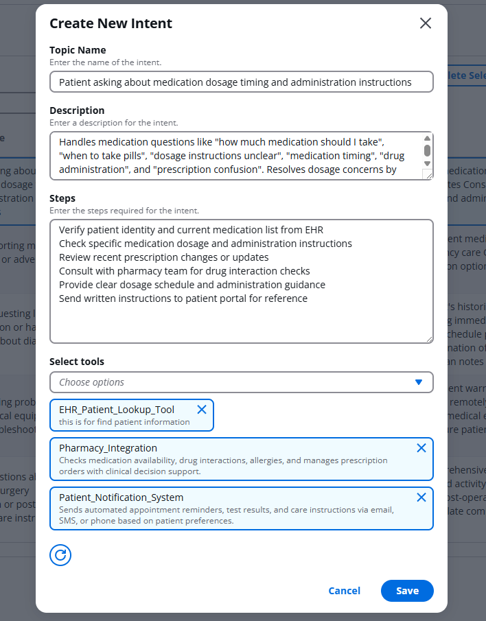

# Sitaara: AI-Powered Support Case Resolutions

Sitaara is a comprehensive AI-driven customer support platform that revolutionizes how businesses handle customer inquiries. Built on AWS serverless architecture with Agentic AI, Sitaara intelligently understands customer issues, and executes automated solutions.

# Features
## **🎯 Intent Creation and Tools Attachment**

Create comprehensive Standard Operating Procedures (SOPs) for customer issues by defining intents with step-by-step workflows and attaching custom tools. The AI agent follows these SOPs exactly, ensuring consistent resolution processes across all similar cases without deviation or hallucination.

## **🤖 Intent Recognition with Human-in-Loop**
Advanced AI analyzes customer queries with confidence scoring. When confidence is >90%, the system proceeds automatically. For lower confidence scores, the system presents multiple intent options to human agents for verification, ensuring accurate issue classification before resolution begins.

## **⚡ Automated Resolution with Customer Interaction**
AI agents execute predefined resolution steps while maintaining natural conversation with customers. The system asks clarifying questions, requests additional information when needed, executes tools in real-time, and provides step-by-step guidance until the issue is fully resolved.

## **📊 Comprehensive Case Summary**
At the end of each resolution, the system generates detailed case summaries including customer issue analysis, AI agent performance evaluation, resolution effectiveness, customer satisfaction assessment, and actionable insights for continuous improvement.

## **🔧 Dynamic Tool Execution Environment**
Build and deploy custom Python scripts as tools that can be executed within conversation flows. These tools handle specific business logic, API integrations, database queries, or any automated actions needed to resolve customer issues effectively.

### [Click to understand how AWS Lambda is the ❤️ of the solution](ARCHITECTURE.md)

[Want to try it yourself?](TRYIT.md)
